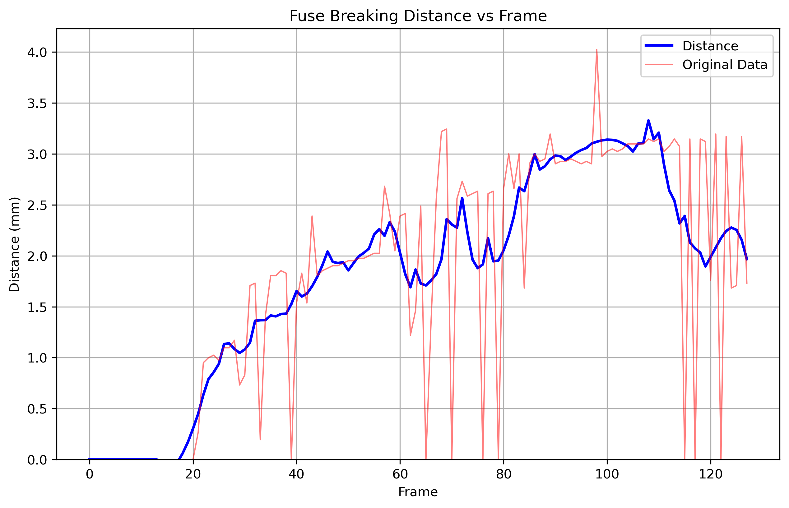
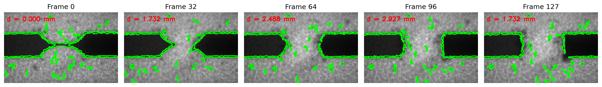

# High-Speed Fuse Break Analysis

This project analyzes high-speed X-ray radiography videos of industrial fuses to measure the distance between fuse elements during breaking events. It processes video frames to track how the gap between fuse elements changes over time when an electric arc is generated.

## Overview

High-rupturing capacity (HRC) fuses are critical safety components in electrical systems. When a short circuit occurs, these fuses must break quickly to protect the circuit. This project analyzes X-ray radiography videos of fuse breaking events to measure the distance between the fuse elements over time, providing insights into the breaking dynamics.

## Features

- Video frame extraction and processing
- Automatic segmentation of fuse elements using advanced image processing
- Calibration using known physical dimensions (H parameter)
- Precise measurement of distance (d) between fuse elements
- Data smoothing using Savitzky-Golay filtering
- Comprehensive visualization (plots, comparison grids, annotated video)
- Data export to CSV for further analysis

## Methodology

### 1. Image Processing Approach

The project uses a multi-stage image processing pipeline:

1. **Preprocessing**:
   - Gaussian blur to reduce noise
   - Otsu's thresholding for optimal binarization of X-ray images
   - Morphological operations (opening and closing) to clean up the binary image

2. **Segmentation**:
   - Connected component analysis to identify distinct regions
   - Filtering based on area to remove noise
   - Identification of the main fuse elements

3. **Calibration**:
   - Using the known height (H) of the fuse (2mm) as a reference
   - Calculating the pixels-per-millimeter ratio for accurate measurements

4. **Distance Measurement**:
   - Identifying the left and right fuse elements
   - Measuring the gap between them in pixels
   - Converting to millimeters using the calibration factor
   - Applying smoothing to reduce measurement noise

## Requirements

- Python 3.7+
- OpenCV
- NumPy
- Matplotlib
- scikit-image
- pandas

## Installation

1. Clone this repository:
```bash
git clone https://github.com/yourusername/High-Speed-Fuse-Break-Analysis.git
cd High-Speed-Fuse-Break-Analysis
```

2. Install the required dependencies:
```bash
pip install -r requirements.txt
```

## Running the Project

### Using the Command Line

For a comprehensive analysis with all visualizations:

```bash
python src/main.py --video_path data/Camera_15_04_58.mp4 --output_dir results --create_video --save_frames
```

### Using Jupyter Notebook

For an interactive analysis:

1. Start Jupyter Notebook:
```bash
jupyter notebook
```

2. Open `notebooks/fuse_break_analysis_notebook.ipynb`

3. Run the cells to perform the analysis step by step

### Command Line Arguments

- `--video_path`: Path to the video file (default: 'data/Camera_15_04_58.mp4')
- `--output_dir`: Directory to save results (default: 'results')
- `--calibration_frame`: Frame index to use for calibration (default: 1)
- `--calibration_value_mm`: Known height (H) of the fuse in mm (default: 2.0)
- `--save_frames`: Save processed frames (flag)
- `--create_video`: Create video with measurements (flag)
- `--fps`: Frames per second for output video (default: 10)

## Project Structure

The project follows a modular architecture with clear separation of concerns:

```
High-Speed-Fuse-Break-Analysis/
├── data/                   # Input data directory
│   └── Camera_15_04_58.mp4 # Sample video file
├── docs/                   # Documentation
│   └── exam_pratique_2017-2.pdf # Project requirements
├── example_images/         # Example output images
│   ├── distance_vs_frame.png
│   └── key_frames.png
├── notebooks/              # Jupyter notebooks
│   ├── fuse_analysis.py    # Complete code as a Python module
│   └── fuse_break_analysis_notebook.ipynb # Interactive notebook
├── results/                # Output directory for results
├── src/                    # Source code
│   ├── image_processor.py  # Image processing module
│   ├── main.py             # Main script
│   ├── test_fuse_analysis.py # Unit tests
│   ├── video_processor.py  # Video processing module
│   └── visualization.py    # Visualization module
├── .gitignore              # Git ignore file
├── README.md               # Project documentation
└── requirements.txt        # Dependencies
```

### Core Modules

- `src/main.py`: Main script that orchestrates the entire analysis workflow
- `src/video_processor.py`: Handles video loading, frame extraction, and basic video properties
- `src/image_processor.py`: Implements the image processing pipeline, segmentation, and distance measurement
- `src/visualization.py`: Creates all visualizations, plots, and video outputs
- `notebooks/fuse_analysis.py`: Complete code as a single Python module for easy import

### Class Structure

1. **VideoProcessor**:
   - `VideoFrame` class: Stores frame data and metadata
   - Methods for loading videos, extracting frames, and accessing video properties

2. **FuseImageProcessor**:
   - Methods for image preprocessing, segmentation, calibration, and measurement
   - Implements the core image analysis algorithms

3. **FuseAnalysisVisualizer**:
   - Methods for creating plots, comparison grids, and annotated videos
   - Handles all visualization aspects of the analysis

### Data Flow

1. Video frames are extracted from the input video
2. A reference frame is used for calibration
3. Each frame is processed to measure the distance between fuse elements
4. Results are collected, smoothed, and visualized
5. Outputs are saved to the specified directory

## Additional Usage Examples

### Basic Usage

For a quick analysis with default parameters:

```bash
python src/main.py --video_path data/Camera_15_04_58.mp4
```

### Custom Calibration

If you know the exact height of the fuse in millimeters:

```bash
python src/main.py --video_path data/Camera_15_04_58.mp4 --calibration_value_mm 2.5
```

### Using a Different Calibration Frame

If the first frame isn't suitable for calibration:

```bash
python src/main.py --video_path data/Camera_15_04_58.mp4 --calibration_frame 5
```

### Testing the Implementation

Run the included unit tests to verify the functionality:

```bash
cd src
python -m unittest test_fuse_analysis.py
```

## Results and Outputs

The analysis generates the following outputs in the specified output directory:

1. **Data Files**:
   - `distance_measurements.csv`: CSV file with frame indices, original distances, and smoothed distances

2. **Visualizations**:
   - `distance_vs_frame.png`: Plot showing the distance between fuse elements over time
   - `key_frames.png`: Comparison grid of key frames during the breaking event
   - `fuse_break_analysis.mp4`: Video with distance measurements overlaid (if `--create_video` is specified)
   - Individual frame images with measurements (if `--save_frames` is specified)

3. **Interpretation**:
   - The distance plot shows when the fuse begins to break (typically around frame 20)
   - The slope of the curve indicates the speed of the breaking process
   - Fluctuations in the measurements show the dynamic nature of the breaking event

## Example Results

### Distance vs Frame Plot

This plot shows how the distance between fuse elements changes over time:



### Key Frames

This visualization shows key frames from the breaking process:



## Challenges and Solutions

During the development of this project, several challenges were encountered and addressed:

### 1. Image Segmentation Challenges

- **Variable Contrast**: X-ray images often have low contrast and variable illumination
  - *Solution*: Used Otsu's thresholding which automatically determines optimal threshold values

- **Noise and Artifacts**: X-ray images contain noise and artifacts that can interfere with measurements
  - *Solution*: Applied morphological operations (opening and closing) to clean up binary images

- **Multiple Fragments**: After breaking, the fuse can split into multiple fragments
  - *Solution*: Implemented region filtering and grouping to identify the main fuse elements

### 2. Measurement Challenges

- **Calibration**: Converting pixel measurements to physical units requires accurate calibration
  - *Solution*: Used the known height (H) of the fuse as a reference for calibration

- **Measurement Fluctuations**: Raw measurements can fluctuate due to image noise and segmentation variations
  - *Solution*: Applied Savitzky-Golay filtering to smooth the measurements while preserving important features

- **Edge Cases**: Handling frames where the fuse is intact or completely broken
  - *Solution*: Implemented special case detection for intact fuses and frames with insufficient data

## Future Work

Several enhancements could be made to improve the analysis:

1. **Machine Learning Segmentation**: Implement deep learning-based segmentation for more robust fuse element detection

2. **Multi-Fuse Analysis**: Extend the system to analyze multiple fuses simultaneously

3. **3D Reconstruction**: Combine multiple camera angles for 3D reconstruction of the breaking process

4. **Automated Parameter Tuning**: Develop methods to automatically determine optimal processing parameters

5. **Real-time Processing**: Optimize the code for real-time processing of high-speed video streams

6. **Physical Model Integration**: Integrate with physical models of fuse breaking for more comprehensive analysis

## License

This project is licensed under the MIT License - see the LICENSE file for details.

## Acknowledgments

- European Synchrotron Radiation Facility (ESRF) in Grenoble, France for the X-ray radiography data
- Original project requirements from industrial fuse analysis study
- OpenCV, scikit-image, and other open-source libraries that made this analysis possible
